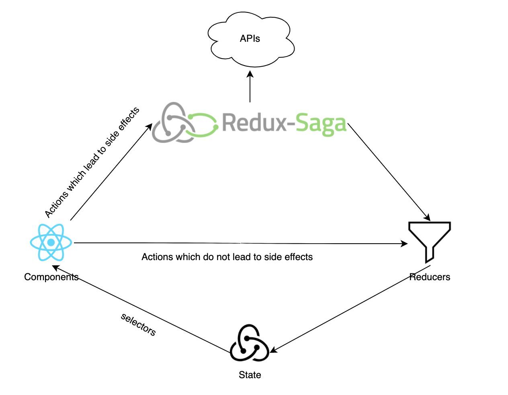

This project was bootstrapped with expo. Requires yarn to be installed as part of the environment.

## Data flow diagram

## Available Scripts

In the project directory, you can run:

### `yarn dev`

Starts the server on port 5000 and launches the expo server in development mode

The application will reload if you make edits. 
You will also see any lint errors in the console.

### `yarn test`

Launches the test runner

### `yarn server`

Starts the server it requires the build folder before hand in order to display the application

Open [http://localhost:5000](http://localhost:5000)
